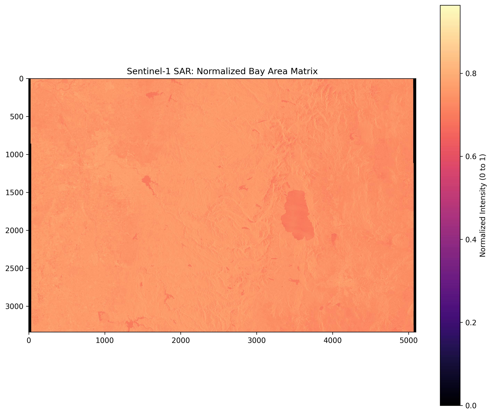

"# sentinel-radar-explorer" 
# 🌍 Sentinel-1 Radar Explorer & AI Pipeline

An end-to-end data engineering project that converts raw electromagnetic satellite pulses into actionable intelligence.

## 🛠 Tech Stack
- **Languages:** Python
- **APIs/Cloud:** Copernicus STAC API, AWS S3 (Boto3)
- **Data Science:** NumPy, Rasterio, Matplotlib
- **Frontend:** Streamlit

## 🚀 Key Features
- **Dynamic Ingestion:** Automatically finds the newest satellite pass over any set of coordinates.
- **Matrix Normalization:** Converts 16-bit raw radar signals into 0-1 normalized tensors.
- **Feature Extraction:** Binary thresholding for automated water/land segmentation.

## 📊 Results

*Normalized radar backscatter of the San Francisco Bay Area.*
